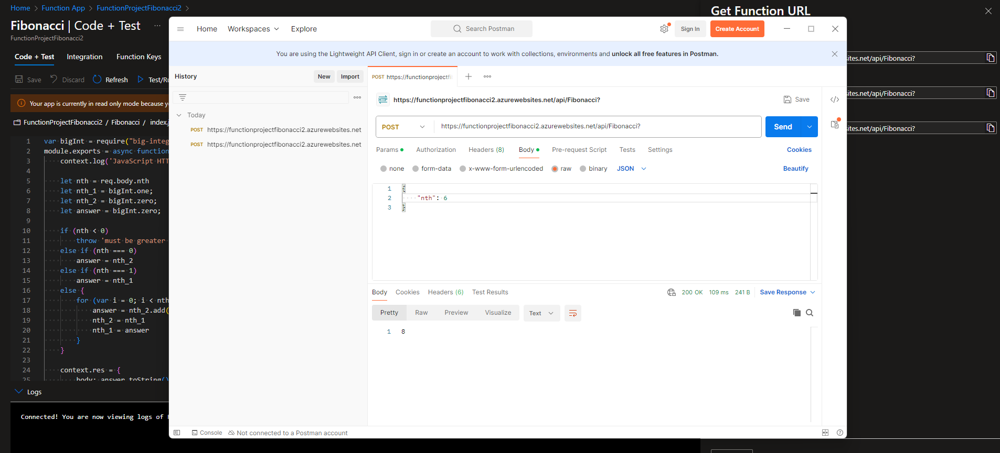
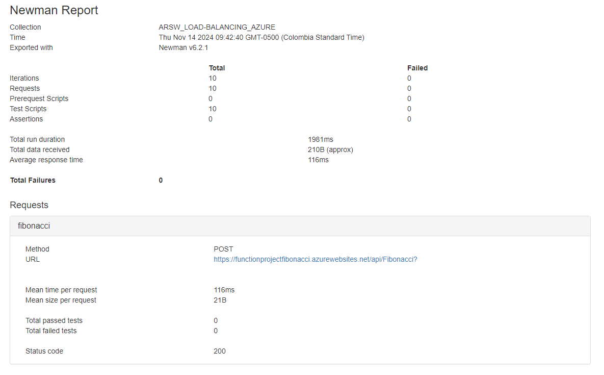
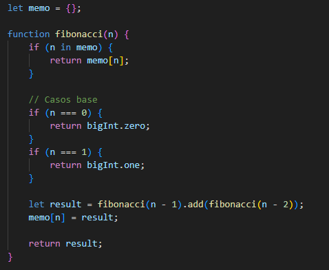

### Escuela Colombiana de Ingeniería
### Arquitecturas de Software - ARSW

## Escalamiento en Azure con Maquinas Virtuales, Sacale Sets y Service Plans

### Dependencias
* Cree una cuenta gratuita dentro de Azure. Para hacerlo puede guiarse de esta [documentación](https://azure.microsoft.com/es-es/free/students/). Al hacerlo usted contará con $100 USD para gastar durante 12 meses.
Antes de iniciar con el laboratorio, revise la siguiente documentación sobre las [Azure Functions](https://www.c-sharpcorner.com/article/an-overview-of-azure-functions/)

### Parte 0 - Entendiendo el escenario de calidad

Adjunto a este laboratorio usted podrá encontrar una aplicación totalmente desarrollada que tiene como objetivo calcular el enésimo valor de la secuencia de Fibonnaci.

**Escalabilidad**
Cuando un conjunto de usuarios consulta un enésimo número (superior a 1000000) de la secuencia de Fibonacci de forma concurrente y el sistema se encuentra bajo condiciones normales de operación, todas las peticiones deben ser respondidas y el consumo de CPU del sistema no puede superar el 70%.

### Escalabilidad Serverless (Functions)

1. Cree una Function App tal cual como se muestra en las  imagenes.

2. Instale la extensión de **Azure Functions** para Visual Studio Code.

3. Despliegue la Function de Fibonacci a Azure usando Visual Studio Code. La primera vez que lo haga se le va a pedir autenticarse, siga las instrucciones.

4. Dirijase al portal de Azure y pruebe la function.

- FunctionApp sirviendo.

5. Modifique la coleción de POSTMAN con NEWMAN de tal forma que pueda enviar 10 peticiones concurrentes. Verifique los resultados y presente un informe.

6. Cree una nueva Function que resuleva el problema de Fibonacci pero esta vez utilice un enfoque recursivo con memoization. Pruebe la función varias veces, después no haga nada por al menos 5 minutos. Pruebe la función de nuevo con los valores anteriores. ¿Cuál es el comportamiento?.

    * La función tarda más en cargar los resultados en comparación a los tiempos de respuesta anteriores a la espera de los 5 minutos.

**Preguntas**

* ¿Qué es un Azure Function?
    * Es un servicio de cómputo sin servidor que permite ejecutar funciones en respuesta a eventos o solicitudes HTTP, sin necesidad de administrar la infraestructura subyacente.
* ¿Qué es serverless?
    * Es un modelo de computación en la nube donde el proveedor gestiona automáticamente la infraestructura, incluyendo servidores y escalabilidad.
* ¿Qué es el runtime y que implica seleccionarlo al momento de crear el Function App?
    * Es el entorno de ejecución que define el lenguaje y la versión compatibles para ejecutar las funciones en una Function App. Al seleccionarlo, decides el lenguaje como Node.js, Python y su versión específica.
* ¿Por qué es necesario crear un Storage Account de la mano de un Function App?
    * Se utiliza para almacenar configuraciones, logs, y el estado de las ejecuciones. Es esencial para el funcionamiento y la administración de la Function App.
* ¿Cuáles son los tipos de planes para un Function App?, ¿En qué se diferencias?, mencione ventajas y desventajas de cada uno de ellos.
    * Consumption Plan:
        * Ventajas:
            * Pago por uso.
            * Escalabilidad automática.
            * Sin gestión de infraestructura.
        * Desventajas:
            * Límites de ejecución.
            * Arranque en frío.
    * Premium Plan:
        * Ventajas:
            * Escalabilidad automática.
            * Funciones sin límites de tiempo.
            * Acceso a VNET.
            * Mayor rendimiento y personalización.
        * Desventajas:
            * Costo más alto.
    * Dedicated (App Service) Plan:
        * Ventajas:
            * Recursos dedicados.
            * Escalabilidad manual y automática.
            * Sin límites de tiempo de ejecución.
        * Desventajas:
            * Costo fijo.
            * Menos flexible que los otros planes en términos de escalabilidad automática.
* ¿Por qué la memoization falla o no funciona de forma correcta?
    *  Esto se debe a que las funciones serverless no mantienen el estado entre invocaciones, lo que significa que los valores previamente almacenados en la caché ya no estarán disponibles.
* ¿Cómo funciona el sistema de facturación de las Function App?
    * Depende del plan de hosting seleccionado:
        * Consumption Plan: Se paga solo por el tiempo de ejecución y las invocaciones, con una cuota gratuita mensual.
        * Premium Plan: Ofrece más características avanzadas, como la ejecución sin límite de tiempo y escalabilidad rápida, pero a un costo más alto debido a recursos dedicados.
        * Dedicated Plan: Se paga por recursos fijos, independientemente de la ejecución, proporcionando rendimiento predecible y control, aunque a un costo constante.
* Informe

### Milton Gutierrez | Juan David Contreras